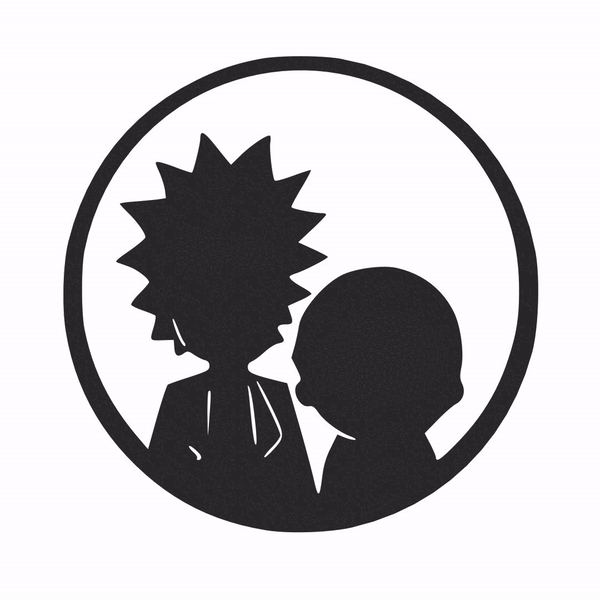

<!-- PROJECT LOGO -->
 

  

  <h3 align="center">Rick and Morty App</h3>

<!-- DESCRIPTION -->
This is a simple code test with the purpose of develop an app to review every single character of the Rick and Morty TV using the [Rick and Morty API](https://rickandmortyapi.com/).

- Apply things like SOLID
- Very image oriented
- UX is important

Extra requirements:
- [x] Use SwiftUI
- [x] Cache images from network to improve performance
- [x] Error handling
- [ ] Response caching
- [ ] Implemnt test
- [ ] Filter or Search

<!-- LICENSE -->
## License

Distributed under the MIT License. See `LICENSE.txt` for more information.

(<a href="#readme-top">back to top</a>)
